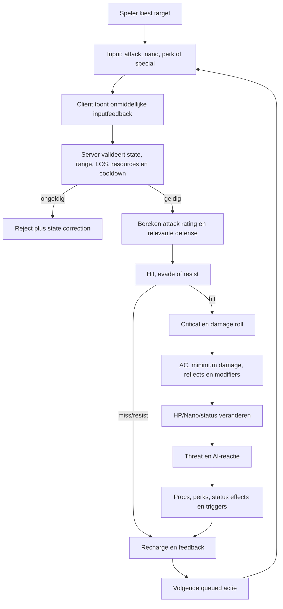
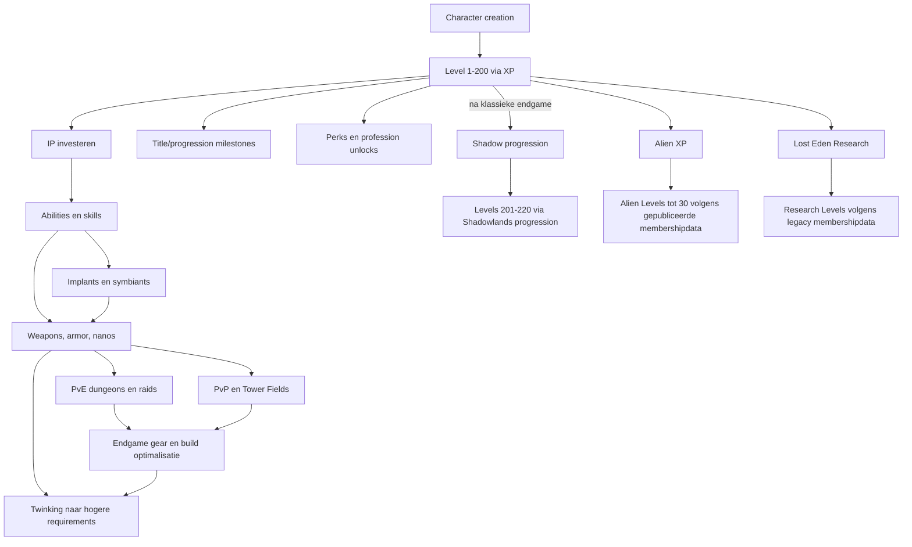

# Moderne remake van *Anarchy Online*: ontwerp-, technologie- en productierapport

## Executive summary

Een moderne remake van *Anarchy Online* moet **niet** worden ontworpen als “een moderne MMO met een AO-skin”. De blijvende onderscheidende waarde van AO zit juist in systemen die hedendaagse MMO’s vaak hebben vereenvoudigd: stat-based equipment in plaats van zuivere level-gating, Improvement Points en zeer veel skills, implants en buffs als puzzel, NCU-capaciteit, nanos, professionele asymmetrie, equipment “twinking”, procedurele terminal-missies, factionele territoriumoorlog, complexe crafting en een sterk door spelers gedragen sociale infrastructuur. Funcom benadrukt ook nu nog precies die aspecten: gear is gebaseerd op stats in plaats van levels, en spelers stapelen gear, perks, implants en buffs om hogere uitrusting te kunnen dragen. De historische officiële site noemt ongeveer 80 character skills, honderden special attacks en duizenden items. citeturn21view2turn2search3

De remake zou daarom het beste als een **“Rubi-Ka First” licensed remake** worden gebouwd: eerst de planeet Rubi-Ka, de 14 professions, het klassieke skill-/implant-/nano-/mission-/economy-/organization-systeem, Notum Wars en een representatieve set dungeons en raids. Shadowlands, Alien Invasion, Lost Eden en Legacy of the Xan kunnen vervolgens in productie worden genomen als afzonderlijke contentlagen. Dat vermindert tegelijk ontwikkelrisico en de overweldigende onboarding die ontstaat wanneer twintig jaar uitbreiding in één launch-client terechtkomt. De huidige officiële AO-site noemt nog steeds Rubi-Ka, Shadowlands, Alien Invasion, Tower Fields, Battlestation en Tarasque als kenmerkende onderdelen van het spel. citeturn21view2

**De drie ontwerpprincipes die absoluut behouden moeten blijven zijn:**

| Kern | Wat behouden | Wat moderniseren |
|---|---|---|
| **Character engineering** | IP, abilities, skills, implants/symbiants, buffs, NCU, perks, stat-based gear, over-equipping/twinking | In-game planner, begrijpelijke dependency-weergave, preview van buff-stacks, loadouts, undo tijdens vroege levels |
| **Asymmetrische professions** | 14 sterk verschillende rollen, pets, drains, crowd control, heals, reflects, morphs, nukes, auras | Responsievere controls, duidelijke telegraphs, minder noodzakelijke buff-alts, betere solo-baseline zonder rollen gelijk te trekken |
| **Sociaal-politieke wereld** | Omni-Tek/Clan/Neutral, organizations, Tower Fields, handel, craftingdiensten, chats, raids | Matchmaking naast handmatige groepen, moderne guildadministratie, auditlogs, moderation, events, betere marktinterface |

De grootste fout zou zijn om AO te “verbeteren” door die complexiteit weg te abstraheren. AO’s Improvement Point-systeem geeft per level een beperkte hoeveelheid IP, terwijl skillkosten per profession verschillen; spelers kunnen dus expliciet niet alles maximaliseren. Abilities leveren bovendien “trickle-down” naar skills. Dat vormt de fundamentele economische puzzel van een character build. citeturn10view1

De **combatlaag** verdient modernisering, maar geen volledige omzetting naar twitch/action combat. AO combineert Attack Rating, afzonderlijke defensive skills, initiatives, de Agg/Def-slider, weapon attack/recharge, specials, nanos en verschillende damage modifiers. De communitydocumentatie beschrijft bijvoorbeeld een minimum van 1 seconde attack en 1 seconde recharge voor conventionele weapon cycles, initiatives die de tijden beïnvloeden, en een damageberekening waarin Attack Rating, AC, minimum damage, reflect en additive damage ieder een rol spelen. Een action-MMO zou de onderliggende build-engineering verdringen door reflexvaardigheid; een modern target-based/soft-target systeem met veel betere animaties en feedback behoudt de identiteit beter. citeturn10view0

De **originele AO-serverarchitectuur is grotendeels niet publiek gedocumenteerd**. Dit moet expliciet worden onderscheiden van fan-emulators. Project Rubi-Ka stelt dat het team geen toegang heeft tot de oorspronkelijke AO-broncode en het protocol reconstrueert door verkeer tussen client en Funcom-servers te bestuderen; zelfs zaken zoals oorspronkelijke pathfinding zijn daardoor niet vanzelf bekend. CellAO implementeerde op zijn beurt eigen Login-, Zone- en Chat-services en gebruikte C#/MySQL, maar dat bewijst uitsluitend iets over CellAO, niet over Funcoms oorspronkelijke backend. citeturn5search23turn5search0turn5search3

Voor een remake adviseer ik daarom een **server-authoritative zoned MMO architecture**: Unreal Engine voor client en zone simulation, afzonderlijke stateless/state-light services voor accounts/social/economy/content, PostgreSQL voor de gezaghebbende persistente staat, Redis uitsluitend voor ephemeral/cache/presence, Kubernetes voor platformservices en Agones vooral voor dynamische instances zoals missions, raids en Battlestation. Epic documenteert UE’s multiplayermodel expliciet als client/server met een authoritative server; Agones is specifiek ontworpen voor het deployen, schalen en orchestreren van dedicated game servers. citeturn16view0turn16view2

**Financieel** acht ik voor een commercieel, gelicenseerd “Rubi-Ka First”-product een planning van ongeveer **€55–95 miljoen tot en met launch** realistisch als interne planningsbandbreedte, met een piekteam van ongeveer **90–130 mensen**, circa **vier tot vijf jaar** ontwikkeling en substantiële outsourcing voor environment art, cinematics, QA en localization. Dit is een bottom-up projectraming, geen publiek Funcom-budget. Een remake die bij launch vrijwel de volledige historische AO + grote expansions wil evenaren, schuift naar ongeveer **€80–140 miljoen of meer** en **vijf tot zes jaar**. **Een eventuele Funcom-IP-licentievergoeding is hierbij niet inbegrepen en is publiek niet gespecificeerd.**

Juridisch is een **licentie-first strategie sterk aan te bevelen**. Funcom vermeldt op de officiële AO-site zelf dat “Anarchy Online” een geregistreerd handelsmerk van Funcom Oslo AS is en dat logo’s, characters, names en distinctive likenesses Funcom-IP zijn. De EU-softwarewetgeving kent onder voorwaarden ruimte voor decompilatie ten behoeve van interoperabiliteit, en het Hof van Justitie heeft in *SAS Institute v World Programming* onderscheid gemaakt tussen softwarefunctionaliteit en de auteursrechtelijk beschermde uitdrukkingsvorm ervan. Dat is echter geenszins een algemene toestemming om AO’s tekst, assets, maps, databaseinhoud, muziek of branded world te kopiëren. citeturn21view2turn7search0turn20search13turn20search33

Mijn centrale productadvies is daarom:

> **Bouw een gelicenseerde remake die AO’s systeemcomplexiteit bewaart, maar de gebruiker niet langer verplicht die complexiteit via externe websites, alt-accounts, spreadsheets en twintig jaar verworven voorkennis te ontcijferen. Moderniseer de presentatie en infrastructuur; niet de fundamentele vrijheid om het systeem te “breken” door het beter te begrijpen dan een gemiddelde speler.**

## Bronnenbasis en ontwerpdoelen

De bronnenbasis kent een belangrijke beperking. Bij deze research kwamen **geen substantiële Nederlandstalige primaire AO-documentatie of Nederlandstalige Funcom-developerinterviews** naar voren. Er bestaan Nederlandstalige secundaire vermeldingen, maar de bruikbare primaire historische en actuele AO-bronnen zijn vrijwel volledig Engelstalig. Daarom is de prioriteitsvolgorde hier: officiële Funcom/AO-bronnen; officiële EU-juridische bronnen; primaire preservation-/emulatorprojecten; daarna AO-Universe als uitgebreide communitydocumentatie. Waar een mechanisme niet betrouwbaar uit deze bronnen volgt, wordt het als **ongespecificeerd** aangemerkt.

De officiële AO-homepage is bovendien zelf een combinatie van actuele beschikbaarheid en legacy-marketingtekst. Op 8 september 2026 presenteert de site AO nog als gratis speelbaar en vermeldt zij dat voor *Anarchy Online* plus *Notum Wars* geen subscription nodig is; dezelfde pagina vermeldt ook nog “New engine – open beta available” en een copyrightfooter die tot 2019 loopt. De membership-pagina is toegankelijk, maar vermeldt expliciet dat zij voor het laatst op 20 juni 2017 werd bijgewerkt. Exacte huidige entitlement-details uit die membership-tabel moeten daarom vóór een commerciële analyse opnieuw met Funcom worden geverifieerd. citeturn21view2turn22view0

De officiële Funcom-forums tonen nog AO-activiteit in 2026. Dat bewijst dat er een levende communitycomponent is, maar **niet** hoeveel actieve of betalende spelers het spel momenteel heeft; dergelijke bevolkings- of omzetcijfers zijn in de geraadpleegde bronnen niet publiek vastgesteld. citeturn3search3

Historisch presenteerde Funcom AO als een sciencefiction-MMORPG met 80 character skills, honderden speciale aanvallen en duizenden items. De officiële archiefsite noemt 14 professions: Adventurer, Agent, Bureaucrat, Doctor, Enforcer, Engineer, Fixer, Keeper, Martial Artist, Meta-Physicist, Nano-Technician, Shade, Soldier en Trader. citeturn2search3turn0search0

**Wat “remake” technisch en juridisch kan betekenen:**

| Route | Definitie | Voordeel | Nadeel / risico | Advies |
|---|---|---|---|---|
| **Gelicenseerde remake** | Nieuwe code en assets, met formele rechten op AO-naam/world/content | Maximale merkwaarde; authentieke wereld, lore en nomenclatuur | Licentieonderhandeling, approvals, royalty’s of minimum guarantees zijn **ongespecificeerd** | **Voorkeur** |
| **Clean-room spiritual successor** | Nieuwe IP en nieuwe content, maar geïnspireerd door abstracte systeemprincipes | Volledige technische vrijheid; veel lager IP-risico | Geen AO-naam, Rubi-Ka, Omni-Tek, professions, bestaande lore/assets | Sterke fallback |
| **Client-compatible emulator** | Server die een bestaande AO-client/protocol probeert te ondersteunen | Interessant voor preservation/research | Legacy-client beperkingen; security; IP/EULA/contractrisico; geen echte moderne remake | Niet als commerciële hoofdroute |
| **Reverse-engineered remake met gekopieerde data** | Nieuwe executable met geëxtraheerde AO-assets/data/content | Snelle contentreconstructie | Zeer hoog auteursrechtelijk, contractueel en merkrisico | Afwijzen |

Project Rubi-Ka vormt een nuttige technische researchbron juist omdat het project transparant stelt dat het geen originele broncode heeft en servergedrag door observatie probeert te emuleren. Dat is waardevol voor preservation, protocolanalyse en het identificeren van externe gedragspatronen, maar mag niet worden verward met een documentatielek van de originele Funcom-architectuur. citeturn5search12turn5search23

De ontwerpdoelstelling moet daarom bestaan uit **behavioral fidelity zonder architectural archaeology**: reconstrueren hoe AO voor een speler *werkt* en waarom dat interessant is, maar de nieuwe backend ontwerpen volgens hedendaagse betrouwbaarheid-, security- en live-operationsvereisten.

## Gameplaymechanieken

De onderstaande matrix behandelt alle door de vraag gevraagde gameplaycategorieën. “Origineel” betekent het gedocumenteerde AO-gedrag; details die niet betrouwbaar uit de geraadpleegde documentatie volgen worden bewust niet ingevuld.

| Mechaniek | Doel | Originele AO-implementatie | Moderne verbetering / optie | Voor- en nadelen | Implementatienotitie |
|---|---|---|---|---|---|
| **Professions** | Sterke character identity en build-asymmetrie | 14 professions; profession beïnvloedt onder andere IP-kosten, nanos, perks, gear en rollen. citeturn0search0turn10view1 | Alle 14 behouden; duidelijke starter-archetypes, buildtemplates en advanced mode | **+** Zeer sterke replayability. **−** Balans- en onboardinglast | Eén gemeenschappelijk ability-componentmodel; profession definieert cost tables, nano/perk toegang en modifiers als versioned data |
| **Skills** | Speler laat zelf bepalen waarin character goed is | Officieel circa 80 character skills; IP per level; verschillende profession costs; onmogelijk alles te maxen. citeturn2search3turn10view1 | Behouden, met zoekfunctie, impact-preview, aanbevolen ranges en beperkte low-level respec | **+** Essentie AO. **−** Beginners kunnen character beschadigen | Server bewaart base skill + IP investment; alle tijdelijke modifiers afzonderlijk zodat audits mogelijk blijven |
| **Stats / abilities** | Basislaag voor skills, HP/nano en equipment | Abilities hebben trickle-down naar skills; Body Development en Nano Pool beïnvloeden respectievelijk HP en Nano Energy. citeturn10view1 | Dependency graph en “wat verandert als ik +12 Agility krijg?”-preview | **+** Twinking wordt begrijpelijk. **−** UI kan zeer technisch worden | Deterministische stat graph; detecteer cycles in modifiers tijdens content-build |
| **Combat** | Stats/builds omzetten in moment-to-moment beslissingen | Attack Rating versus defenses; weapon attack/recharge; initiatives; Agg/Def; crit; AC; reflects; specials, nanos en pets. citeturn10view0 | Responsive soft/tab targeting, input buffering, betere telegraphs en animatie, maar dezelfde statistische kern | **+** AO-identiteit blijft intact. **−** Minder onmiddellijk dan volledige action combat | Server berekent hit, crit, damage, cooldowns en resources; client voorspelt alleen presentatie/movement |
| **NPC- en pet-AI** | PvE-tegenstand en profession identity | Mobs kunnen specifieke gedragingen hebben zoals nukes en adds; precieze originele AI-, pathfinding- en threat-architectuur is publiek **ongespecificeerd**. citeturn19view0turn5search23 | Behavior trees/utility layers, threat model, encounter scripting, navmesh, stuck recovery | **+** Betrouwbaarder encounters. **−** Te “slimme” AI kan oude tactieken vernietigen | Simulation server authoritative; AI heeft deterministic debug trace en replay |
| **PvE** | Exploration, leveling, loot, skill mastery | Open-world camps/dynas, mission instances, quests, static en instanced dungeons; raids gebruiken tank/heal/CC/DPS-achtige functies. citeturn18view0turn19view0 | Meer dynamische zone-events en encounter telegraphs; beperkte scaling | **+** Meer levendige wereld. **−** Global scaling kan QL/geografische identiteit vernietigen | Level ranges per regio behouden; event-director mag content toevoegen maar geen universele enemy normalization |
| **PvP** | Faction conflict, buildcompetitie, endgame | Suppression gas, PvP-levelranges, duels, Notum/Tower Fields, Battlestation en andere PvP-locaties. citeturn11view0turn21view2 | Twee regimes: gear-driven “Legacy PvP” en optioneel genormaliseerde competitive queue | **+** Twinks én competitieve spelers bediend. **−** Splitst population | Zelfde authoritative combat; aparte matchmaking/ratingservice voor instanced PvP |
| **Groups** | Synergie tussen professions | Teams bestaan bij mission pulls uit maximaal zes spelers; rollen zijn flexibel en profession-combinaties zijn belangrijk. citeturn12view3turn19view0 | LFT + modern party finder, role tags en build inspect met privacycontrols | **+** Lagere groepsfrictie. **−** Automatching kan sociale afhankelijkheid verminderen | Matchmaker als hulpmiddel; behoud handmatige invites, friends en org-first grouping |
| **Raids** | Grote coördinatie en unieke loot | Raid interface organiseert meerdere teams, health/nano bars, raid chat en loot rights; tank, healer, crowd-control en damage rollen worden in communityguides beschreven. Exacte hard cap is in de hier geraadpleegde bron **ongespecificeerd**. citeturn19view0turn19view1 | Ready checks, markers, encounter journal, role assignment, optional personal loot | **+** Minder bot/external-tool afhankelijk. **−** Te veel tooling kan ontdekking reduceren | Raid state server-side; encounter lockouts en loot grants als idempotente transactions |
| **Progression** | Lange characterontwikkeling met parallelle systemen | Gear/stat progression, implants, nanos, perks, levels en expansionsystemen stapelen op elkaar. citeturn21view2turn18view0 | Parallelle systemen behouden maar gefaseerd unlocken; account-wide catch-up op oudere systemen | **+** Diepte zonder startscherm-chaos. **−** Catch-up kan prestige verdunnen | Elke progression track afzonderlijk versioned; account en character progression niet vermengen zonder expliciet ontwerp |
| **Levels / XP / SK** | Tempo en contentgating | Gepubliceerde membership-tabel: free max 200, members 220; 20 Shadowlevels, 30 Alien Levels en 70 Research Levels. Pagina is uit 2017 en exacte actuele entitlement-status vereist verificatie. citeturn22view0 | Hoofdlevel 1–220 blijft; legacy paralleltracks via episodes/tutorialisering; betere rested/catch-up alleen voor alts | **+** Herkenbaar. **−** Veel afzonderlijke XP-valuta’s | Integer/64-bit XP-ledger; geen client-authoritative XP; source-tag elke award |
| **Missions** | Herhaalbare, gedeeltelijk procedurele solo/teamcontent | Mission terminals, solo/team, meerdere sliders voor moeilijkheid, missiontype/gedrag/reward en varianten zoals retrieve, repair, find en kill. citeturn12view3 | Hand-authored room modules + seeded procedural layouts/objectives/mutators | **+** Een van AO’s uniekste systemen. **−** Procedural repetitie zichtbaar na honderden runs | Mission seed + templateversion persistent opslaan; rewards server-side laten genereren |
| **Quests** | Narratief, wereldopbouw en vaste progression | Naast terminals bestaan vele handgemaakte quests, start-up chains en profession-/faction-specifieke quests. citeturn18view0 | Questgraph, betere journal, optionele waypointinformatie en replayable story summaries | **+** Minder wiki-afhankelijk. **−** Te expliciete guidance vermindert exploratie | Data-driven graph editor met conditions/actions en schema-validation |
| **Crafting** | Spelerexpertise, itemverbetering en sociale dienstverlening | Source/target itemcombinaties, skill requirements, Quality Level en tradeskill UI; Engineers/Traders zijn bijzonder geschikt, met aanvullende profession niches. citeturn12view2 | Recipe discovery/library, batchcraft, work orders, QL preview en provenance | **+** Minder administratieve frictie. **−** Recipe library kan kennis-economie reduceren | Recipe engine volledig data-driven; operation atomair: consume inputs en create output in één DB-transaction |
| **Economy** | Waarde geven aan loot, crafting en characterontwikkeling | Credits, NPC shops/vendors, variabele QL-stock en player market/GMI vormen belangrijke handelslagen. citeturn19view3turn22view0 | Marktprijs-historie, orderboek/listings, duidelijke credit sinks, economy telemetry | **+** Transparantere markt. **−** Prijsgrafieken versnellen arbitrage | Double-entry economy ledger voor currency creation/destruction |
| **Trading** | Directe speler-speleruitwisseling | Shops/GMI, craftingdiensten en mail/COD ondersteunen handel; de 2017-membershippagina noemt GMI-toegang als memberfeature. citeturn19view3turn12view0turn22view0 | Escrow, veilige trade preview, buy orders, service work orders | **+** Veel minder scams/fouten. **−** Minder sociale onderhandeling | Iedere transfer krijgt transaction ID, provenance en anti-duplication constraints |
| **Housing** | Persoonlijke expressie en social space | Rubi-Ka apartments; expansioncontent kon extra apartments geven; maximaal 30 furniture-items in de gedocumenteerde klassieke apartment, guests via team, furniture zonder collision/interactie. citeturn19view2 | Instanced account-housing, free placement, permissions, org HQ en trophies | **+** Sterke cosmetic monetization zonder combat power. **−** Asset- en storagekosten | Furniture als lightweight transforms + asset IDs; decoratie valideert collision/bounds server-side |
| **Social systems** | Spelerretentie en wereldcultuur | Factions, teams, LFT, organizations, public/private chatgroepen, bots en player-run events; Funcom noemt expliciet sociale events zoals fashion/rave/trade-show-achtige activiteiten. citeturn18view1turn21view2 | Social hub, calendars, events, communities, richer presence en privacy | **+** Ondersteunt nichecommunity. **−** Moderation- en privacylast | Social graph als afzonderlijke service, privacy-by-default |
| **Guilds / organizations** | Langetermijnidentiteit en collectieve economie/PvP | Organizations hebben eigen chat en governance/ranks; communitydocumentatie beschrijft meerdere governancevormen, organization bank/tax/contracts en cityrechten. citeturn11view1 | Fine-grained RBAC, audit log, calendar, recruitment, shared projects en org housing | **+** Minder officer-frictie. **−** Complexere backend | Geen hardcoded ranknamen voor permissions; roles en permissions afzonderlijk opslaan |
| **Chat** | Coördinatie, handel en community | Zeer configureerbare vensters, tabs, public/private groups, combat channels, logging, filters, timestamps en bot/private channels. citeturn18view1 | Zelfde flexibiliteit + search, mentions, spamfilter, reporting, accessibility/TTS | **+** Behoudt AO’s sterke chatcultuur. **−** Moderne safetyvereisten verhogen ops-kosten | Chat apart schaalbaar; moderation events append-only bewaren volgens retentionbeleid |
| **Mail** | Offline communicatie en waardeoverdracht | Mail kan communicatie, credits, COD en één item bevatten; guide noemt onder meer delivery modes, itemrestricties, inboxlimieten en expiratie. citeturn12view0 | Meerdere attachments, account mail, escrow, reclaim archive, spam controls | **+** Veel bruikbaarder. **−** Extra surface voor RMT/fraude | Mail attachments niet “kopiëren”: ownership atomair naar escrowcontainer verplaatsen |

**Professions in detail**

De 14 professions moeten niet naar een generieke tank/healer/DPS-trinity worden gereduceerd. AO’s raidcultuur kende wel tank-, healer-, crowd-control- en damagefuncties, maar individuele professions konden verschillende combinaties vervullen en raidteams werden juist rond zulke synergieën gebouwd. AO-Universe noemt de Enforcer bijvoorbeeld expliciet “The Ultimate Tank”; Engineer-guides zijn gestructureerd rond pets, skills, strategy en tradeskills, terwijl Soldier-guides tank-/tauntstrategieën bespreken. citeturn18view0turn19view0turn14search0

| Profession | Historische functionele identiteit | Modern remake-advies |
|---|---|---|
| **Adventurer** | Veelzijdige explorer/hybrid met healing, morphing en meerdere weaponopties | Maak morphs ook visueel/gameplaymatig belangrijk; behouden als flexibele solo-/group-profession zonder “beste in alles” te worden |
| **Agent** | Rifle/concealment/burst-damage en het kenmerkende idee andere professionele nano-identiteiten gedeeltelijk te imiteren | Behoud dit als hoge-complexiteitsprofession; geef UI die duidelijk toont welke gedelegeerde abilities beschikbaar zijn |
| **Bureaucrat** | Crowd control, charms/pets, buffs en teamondersteuning | Maak crowd control relevant in encounters; vermijd moderne boss-immuniteit tegen vrijwel alle control |
| **Doctor** | Primaire healing, sustain en offensieve debuff/DoT-tools | Behoud hoogste healing ceiling, maar geef actieve damage/supportkeuzes tijdens lage incoming damage |
| **Enforcer** | HP-/taunt-georiënteerde primaire tank; communityguide positioneert hem expliciet zo. citeturn18view0turn19view0 | Duidelijke threat feedback, actieve mitigation en taunttelegraphs; geen simplistische “press taunt on cooldown”-tank |
| **Engineer** | Combat pets plus sterke tradeskill-identiteit. citeturn18view0turn12view2 | Pet command wheel, responsive pathing; crafting specialisatie mag economische relevantie behouden |
| **Fixer** | Mobiliteit/Grid-identiteit, SMG-achtige ranged gameplay, evasion/support | Moderniseer Grid en snelle travel tot herkenbare class utility; voorkom dat universele fast travel deze niche vernietigt |
| **Keeper** | Melee-support via persistente team/aura-effecten | Maak aura ranges/status duidelijk; ondersteun frontline support in plaats van passieve buffbot |
| **Martial Artist** | Melee/fist combat, crit-georiënteerde damage en ondersteunende sustain | Zeer responsieve combo-animaties, maar specials blijven stats/cooldowns gebruiken |
| **Meta-Physicist** | Multi-pet en nano-oriented support/debuff identity | Maak meerdere pets beheersbaar met formations/priorities; voorkom micro-management als grootste moeilijkheid |
| **Nano-Technician** | Nano-gebaseerde directe damage/area/control specialist | Spectaculaire casting en resourcebeheer; niet transformeren in standaard mana-mage zonder AO’s nano-skill checks |
| **Shade** | Zeer gespecialiseerde melee damage, positional/perk-chain karakter | Gebruik duidelijke positional indicators en chaining UI; behoud hoge skill ceiling |
| **Soldier** | Ranged weapon specialist, reflects en secundaire tankmogelijkheden; historische guides beschrijven ook taunt- en add-controlstrategieën. citeturn14search0 | Sterke ranged fundamentals en actieve reflect windows; eenvoudig instappen, hoge optimalisatie via weapon/special timing |
| **Trader** | Skill drains/wrangles, economy/crafting en support | Behoud unieke transfer/drain-fantasie; beperk de noodzaak van permanente “wrangle alts” via betere sociale bufftools |

De tabel is een **functionele synthese** van de gedocumenteerde professioncatalogus en historische communityguides; exacte nano-, perk- en itemlijsten verschillen per patch en zijn in deze research niet volledig gereconstrueerd. Die numerieke details moeten in preproductie uit gelicenseerde gamedata of een formeel gevalideerde contentdatabase worden gehaald. citeturn0search0turn18view0

**Skills, stats, implants, NCU en twinking**

Dit is waarschijnlijk het belangrijkste systeem om ongewijzigd in *filosofie* maar radicaal verbeterd in *UX* terug te brengen. AO kent verschillende skillcategorieën voor wapens, initiative/speed, trade/repair, nano/aiding, spying/navigation enzovoort. Skills kosten afhankelijk van profession meer of minder IP; Treatment is onder andere relevant voor implant-equipping, terwijl Computer Literacy samenhangt met NCU en Grid-gebruik. citeturn10view1turn18view0

Het moderne equivalent moet daarom geen automatische “item level = character level”-curve worden. Een item krijgt requirements; de speler mag via permanent geïnvesteerde skills, equipment, implants, buffs, perks en tijdelijke effects proberen die requirements te bereiken. De officiële AO-site noemt precies deze ladder van gear, perks, implants en buffs als kernfeature. citeturn21view2

De verbetering moet bestaan uit een ingebouwde **Twink Planner**. Wanneer de speler bijvoorbeeld een QL-hoger implant wil installeren, toont de UI:

`doel-item → benodigde Treatment/Ability → huidige permanente waarde → buffbronnen → equipbare intermediate items → NCU-kosten → welke buff na equip mag verdwijnen → Over-Equipping-status`.

Dat lost de kennisbarrière op zonder de puzzel op te lossen voor de speler.

**Combat-loop**

AO-Universe beschrijft een combatcyclus waarin weapon attack time, range/hit check, mogelijke critical, damage en recharge achtereenvolgens een rol spelen. Attack Rating beïnvloedt hitkans en damage, defenses omvatten Dodge-Ranged, Evade-Close Combat, Duck-Explosions en Nano Resistance, terwijl Agg/Def en initiatives eveneens het resultaat beïnvloeden. De bron merkt bovendien expliciet op dat delen van exacte boven-1000-AR-berekeningen niet volledig bevestigd zijn; zulke numerieke onzekerheid moet dus niet als officiële formule worden behandeld. citeturn10view0



Voor de remake adviseer ik daarbij een **100% server-authoritative damage model**. Client prediction is geschikt voor beweging en visuele respons, maar nooit voor damage, loot, cooldown completion, XP of currency. Dat sluit aan bij Epic’s eigen dedicated-servermodel, waarin de server de “true game state” modereert en clients slechts een benadering daarvan tonen. citeturn16view0

**AI en encounters**

Voor originele AO-AI is voorzichtigheid belangrijk. Raidguides documenteren waarneembaar gedrag zoals nukes, spawning adds en aggro-management, maar de implementatie onder dat gedrag is niet publiek gedocumenteerd. Project Rubi-Ka wijst er juist op dat een emulator zaken als packet structures kan observeren maar bijvoorbeeld oorspronkelijke pathfinding niet automatisch kent. citeturn19view0turn5search23

Een remake kan intern werken met vier lagen:

`Perception → Threat/target selection → Tactical utility → Scripted encounter override`.

Gewone mobs hebben goedkope state machines/behavior trees. Bosses krijgen bovenop dezelfde componenten een encounter graph. Pets gebruiken dezelfde navigatiebasis, maar aparte owner commands en “warp-to-owner if unrecoverably stuck”-logica. Alle AI-beslissingen moeten in debug builds als een trace kunnen worden gereconstrueerd; “waarom viel deze mob de Doctor aan?” moet door QA en designers objectief beantwoord kunnen worden.

**PvE en mission generation**

Mission terminals zijn een systeem dat juist moderner kan aanvoelen dan veel hedendaagse MMO-questing. De gedocumenteerde AO-terminal laat spelers een missiontype en parameters beïnvloeden via meerdere sliders, waaronder moeilijkheid/reward en eigenschappen zoals locks, mobtype of playstyle; mogelijke objectives zijn onder meer retrieve, find, repair en kill. Team missions ondersteunen maximaal zes spelers. citeturn12view3

Een nieuwe generator moet geen generatieve-AI-contentmachine zijn, maar een **deterministische compositiesystematiek**:

`Mission template + faction + biome + objective + room-set + enemy-set + mutators + boss-module + reward-profile + seed`.

Elke module is handgemaakt en getest. De generator combineert modules. Daardoor kan QA een bug altijd reproduceren uit `templateVersion + seed`. Voor story-critical content blijven volledig handgemaakte quests en static dungeons bestaan.

**PvP**

AO onderscheidt verschillende suppression-gasniveaus. Volgens de gedocumenteerde communityregels loopt dat van zones waarin combat niet mogelijk is tot zones met faction- of vrijere PvP-regels; daarnaast bestaan level-range restrictions, duels, Notum Fields/Tower warfare en Battlestation. De huidige officiële site presenteert Tower Fields, Battlestation en Tarasque nog steeds als belangrijke PvP-content. citeturn11view0turn21view2

Een remake moet hier twee ogenschijnlijk conflicterende spelersgroepen bedienen. Het klassieke AO-ideaal is dat **build engineering en twinking voordeel mogen opleveren**. Moderne ranked PvP verlangt daarentegen een zekere competitieve integriteit.

Daarom:

| PvP-mode | Gearmodel | Doel |
|---|---|---|
| **Open world / Tower Fields** | Volledige character build en equipment | AO’s politieke/twinking-identiteit |
| **Legacy Battlestation** | Volledige character build | Twink versus twink |
| **Ranked Battlestation** | Beperkte normalization van basiswaarden, maar profession/buildkeuzes blijven | Esports-achtige fairness zonder professions te homogeniseren |
| **Duels** | Host-selectable ruleset | Testing en community |

Tower warfare verdient vooraf aangekondigde attack windows, organization war logs en robuuste anti-zerg/network degradation. De wereld mag echter niet automatisch alle gear gelijk trekken; daarmee zou een groot deel van AO’s item- en skillgame zinloos worden.

**Group en raid**

De klassieke communitypraktijk onderscheidt tank, healer, crowd control en damage, maar beschrijft ook gespecialiseerde tank-, kill- en healteams en één speler die meerdere functies kan dragen. De raidinterface maakt het mogelijk teams binnen de raid te herschikken, health/nano-bars te volgen en loot rights toe te wijzen. citeturn19view0turn19view1

Modernisering moet hier vooral menselijke coördinatie ondersteunen: ready check, raid markers, role notes, assist-target indicator, battle-resources, mechanic warnings waar ze expliciet door encounterdesign zijn bedoeld, en een robuuste combat log. Geen automatische rotation assistant.

**Progression**

De progression moet als een netwerk worden weergegeven, niet als één verticale XP-balk:



De officiële membershiptabel noemt een levelcap van 200 voor free accounts en 220 voor members, plus 20 Shadowlevels, 30 Alien Levels en 70 Research Levels, maar is gedateerd 20 juni 2017. Die waarden zijn betrouwbaar als door Funcom gepubliceerd historisch model; de exacte commerciële gating in 2026 is daarmee niet volledig bevestigd. citeturn22view0

Een remake kan de mechanische waarden behouden maar de uitrol “seasonaliseren” zonder characters te resetten: launch met 1–200 en Rubi-Ka/Notum Wars; vervolgens Shadowlands/201–220; vervolgens Alien progression; vervolgens research/mechs. Dat creëert launchruimte en voorkomt dat nieuwe spelers op dag één met alle legacy-systemen tegelijk worden geconfronteerd.

**Crafting, economy en trade**

Crafting moet een volwaardige professionele economie blijven. AO’s tradeskilling combineert source- en target-items, skill checks en Quality Levels; de tradeskill-UI kan het resultaat en vereisten tonen, terwijl specifieke professions economisch voordeel hebben in relevante trade skills. Materialen komen uit shops, de wereld en raids, en de historische communitypraktijk omvatte expliciet craftingdiensten en tips. citeturn12view2

Een modern systeem zou drie markten combineren:

1. **Item listings:** traditioneel auction-house/GMI-model.
2. **Buy orders:** “ik koop 20× materiaal X tot prijs Y”.
3. **Craft work orders:** speler deponeert materialen + maximale fee; bevoegde crafter voert recept uit zonder materialen te kunnen stelen.

Voor alle currency-operaties moet de backend een ledger bevatten. “Character heeft 42 miljoen credits” mag niet alleen een mutable kolom zijn; de operator moet kunnen reconstrueren **waar die credits vandaan kwamen en waar ze verdwenen**. Dat is essentieel voor dupe-detectie, rollback, exploitonderzoek en economy balancing.

NPC shops blijven belangrijk als price floor/ceiling en item/credit sink. De community shopping guide documenteert shops, vendors, rotating stock en de Global Market Interface. citeturn19view3

**Housing en social**

Klassieke Rubi-Ka apartments waren leeg bij acquisitie, konden meubels bevatten en lieten guests binnen via teammechanismen; de guide vermeldt een limiet van 30 objecten voor deze apartments en merkt op dat meubels geen collision/sitfunctie hadden. citeturn19view2

Een remake moet housing gebruiken als cosmetic/social endgame zonder combat pay-to-win: apartment templates, org HQ’s, trophies voor raids/PvP, wall displays, mannequins, jukeboxen, crafting workbenches en guest permissions. Furniture kan daarmee ook een langdurige crafting- en monetizationcategorie worden.

**Organizations, chat en mail**

AO’s chatontwerp is opvallend diep. Spelers kunnen meerdere vensters, tabs, public/private groups, combatmessagecategorieën, timestamps en logging configureren. Private groups werden bovendien veel gebruikt door player bots. citeturn18view1

Dat concept is het behouden waard. De remake moet dus niet slechts één “General / Guild / Party”-chatvenster bieden, maar een dockable filter engine met rule presets:

`Damage → combat tab`, `Organization + raid → social tab`, `trade tells → commerce tab`, enzovoort.

Organizations verdienen tegelijkertijd modern RBAC. De AO-Universe-guide beschrijft verschillende governancevormen, ranks en features zoals organization bank, tax/contracts en cityrechten; sommige gedetailleerde historische permissioncombinaties zijn door de communitydocumentatie niet volledig zeker en moeten bij reconstructie als **ongespecificeerd** worden behandeld. citeturn11view1

Mail kan structureel eenvoudiger worden. Het gedocumenteerde systeem ondersteunt text, credits, COD en één item per bericht en hanteert verschillende restrictions en expiryregels. Een remake moet attachments in escrow houden, meerdere attachments toestaan en nooit een item kopiëren wanneer het naar mail wordt verplaatst. citeturn12view0

## Technische architectuur

De belangrijkste architectuurbeslissing is te **weigeren het oorspronkelijke AO-serverontwerp te raden**. Publiek bekende fan-emulators zijn reconstructies. CellAO’s opsplitsing in Login, Zone en Chat is bijvoorbeeld een redelijke architectuur, maar geen bewijs dat Funcom hetzelfde deed. Project Rubi-Ka zegt expliciet dat het AO-servergedrag zonder originele source code emuleert op basis van observatie van protocolverkeer. citeturn5search0turn5search3turn5search23

### Vergelijking van legacy en modern ontwerp

| Technisch gebied | Origineel AO: wat werkelijk bekend is | Modern remakevoorstel | Trade-off |
|---|---|---|---|
| **Client/server** | Online client/servergame; precieze interne servicearchitectuur **ongespecificeerd** | Unreal Engine 5.8 client + dedicated authoritative zone servers | Hoog productiviteitsvoordeel; engine-upgrades vergen governance |
| **Netcode** | Exact protocol, tick rate, replication-/interestmodel **ongespecificeerd** | Server authority, interest management, movement prediction, relevancy prioritization | Meer servercost; veel sterkere cheat boundary |
| **World topology** | Zones/instances zijn waarneembaar; interne hostingtopologie **ongespecificeerd** | Persistent zone workers + dynamische mission/dungeon/PvP instances | Niet één volledig seamless megaserver; wel makkelijker isoleren en schalen |
| **Gameplay simulation** | Exacte implementatie **ongespecificeerd** | C++ authoritative ECS/componentachtige gameplayobjecten binnen zone process | Deterministisch maar engineering-intensief |
| **Account/auth** | Originele interne opzet **ongespecificeerd** | Central identity + session tokens + MFA voor account security | Centrale service is kritieke dependency |
| **Database** | Engine/schema **ongespecificeerd** | PostgreSQL 18 authoritative store | Sterke transactions; horizontale write-scaling moet bewust worden ontworpen |
| **Cache/presence** | **Ongespecificeerd** | Redis voor sessions, cache, rate limiting en presence; nooit authoritative inventory | Snelle reads, maar eventual-state complexiteit |
| **Instance orchestration** | **Ongespecificeerd** | Kubernetes; Agones vooral voor dynamically allocated game servers | Extra operational expertise |
| **Chat/social** | Client heeft diep chat/channel-model | Afzonderlijke horizontally scalable chat/social services | Kan onafhankelijk schalen; distributed-state complexiteit |
| **Economy** | Persistent credits/items; backenddetails **ongespecificeerd** | Transaction ledger + item provenance + idempotent trade service | Meer opslag; veel beter exploitonderzoek |
| **Anti-cheat** | Historische mechanismen **ongespecificeerd** | Server validation, signed client, behavioral telemetry, optional kernel/user-space vendor layer | Privacy en false positives moeten worden beheerd |
| **Modding** | In-game scripting en externe communitytools; AOSharp toont vraag naar C# plugin-achtige uitbreiding. citeturn5search9turn18view0 | Gesanctioneerde sandboxed UI-addon API | Communityinnovatie zonder volledige automationrechten |
| **Live tools** | Oorspronkelijke interne tools **ongespecificeerd** | GM console, content hotfix system, item/quest editors, economy dashboard, replay & audit | Aanzienlijke upfront-toolingkosten |

Epic documenteert voor Unreal Engine 5.8 dat multiplayer het client-servermodel gebruikt, waarbij de server authoritative is en changes naar clients repliceert. De documentatie bevat daarnaast Iris, Replication Graph, replay en debugging als onderdelen van de networkingstack. citeturn16view0turn16view1

**Aanbevolen high-level architectuur**

```mermaid
flowchart TB
    C[PC Client<br/>Unreal Engine] --> EDGE[Edge / DDoS / Gateway]
    EDGE --> AUTH[Identity & Session Service]
    EDGE --> REALM[Realm / World Gateway]

    REALM --> ZM[Zone Manager]
    ZM --> Z1[Persistent Rubi-Ka Zone Server]
    ZM --> Z2[Persistent Rubi-Ka Zone Server]
    ZM --> INST[Instance Allocator]

    INST --> M1[Mission Instance]
    INST --> R1[Raid / Dungeon Instance]
    INST --> P1[Battlestation Instance]

    subgraph Platform Services
        CHAR[Character Service]
        INV[Inventory & Item Service]
        ECON[Economy / Market / Trade]
        SOCIAL[Friends / Organization]
        CHAT[Chat]
        QUEST[Quest / Mission Metadata]
        MAIL[Mail]
        MOD[Moderation / GM]
    end

    Z1 --> CHAR
    Z1 --> INV
    Z1 --> SOCIAL
    M1 --> CHAR
    M1 --> INV
    R1 --> INV
    P1 --> CHAR

    CHAR --> PG[(PostgreSQL)]
    INV --> PG
    ECON --> PG
    SOCIAL --> PG
    MAIL --> PG

    CHAT --> REDIS[(Redis<br/>ephemeral)]
    AUTH --> REDIS
    ZM --> REDIS

    Z1 --> TEL[Telemetry / Events]
    M1 --> TEL
    R1 --> TEL
    ECON --> TEL
    TEL --> OBS[OpenTelemetry / Metrics / Logs / Analytics]

    K8S[Kubernetes] -.manages.-> Platform Services
    AG[Agones] -.allocates dynamic instances.-> INST
```

Agones is volgens de eigen actuele documentatie een open-sourceplatform bovenop Kubernetes voor het deployen, hosten, schalen en orchestreren van dedicated game servers; versie-informatie op de documentatiepagina omvat in september 2026 release 1.60.0. Het bevat onder meer Fleet management, allocation, health checking en autoscaling. citeturn16view2

Mijn nuance is dat **niet iedere AO-zone een Agones matchserver hoeft te zijn**. Een lange tijd levende persistent Rubi-Ka-zone kan beter een gecontroleerde deployment/stateful assignment hebben. Agones is bijzonder geschikt voor disposable mission instances, Battlestation en raids.

**Netcode**

Voor normal combat hoeft een remake geen first-person-shooter-lag-compensationmodel toe te passen. Het target-based/stat-driven karakter maakt het mogelijk om serverbeslissingen te accepteren zonder dat iedere ability client-side hit detection nodig heeft.

Aanbevolen prioriteiten:

`Movement > nearby combat state > hostile casts/status > party/raid state > nearby noncombat entities > cosmetic motion > distant ambience`.

Bij grote Tower Battles kan de updatefrequentie van niet-kritieke properties worden teruggeschakeld. Damage, position validity, ability activation en status effects mogen daarentegen nooit op een lager-consistentieniveau terechtkomen.

Het systeem moet interest management toepassen op ruimtelijke cellen plus uitzonderingen: een raid member, current target of incoming hostile caster kan relevant zijn zelfs wanneer deze buiten een standaard spatial bubble valt. Unreal biedt hiervoor replicationmechanismen en een Replication Graph/Iris-stack; de precieze keuze moet door een multiplayer prototype worden gebenchmarkt. citeturn16view1

**Database en persistentie**

PostgreSQL 18 is een geschikte default voor gezaghebbende account-, character-, inventory- en transactiondata. De actuele PostgreSQL-documentatie ondersteunt declarative range/list/hash partitioning en beschrijft partitioning als het opdelen van één logische tabel in fysieke partitions; dat is vooral nuttig voor zeer grote audit-, market-history- en telemetry-achtige tabellen. citeturn16view3

Belangrijke regels:

- Character en inventory updates die samen horen, committen atomair.
- Ieder uniek item krijgt een `item_instance_id`.
- Itemtemplates zijn immutable/versioned; iteminstances verwijzen naar een templateversie plus instance-state.
- Trades werken via escrow en idempotency keys.
- Currency mint/burn/transfer krijgt ledger entries.
- Login recovery mag nooit “oude snapshot + nieuwe transactions” dubbel toepassen.
- Hotfixes veranderen contentdefinitions, niet stilzwijgend historische iteminstances tenzij een expliciete migration bestaat.

Redis biedt onder andere data structures, Streams en Pub/Sub en kan voor ephemeral realtime state worden gebruikt; de authoritative economy of inventory hoort er echter bewust **niet** in. citeturn15search3

**Scalabilitydoelen**

Als ontwerpdoel, niet als voorspelling van spelerpopulatie, zou ik tijdens ontwikkeling de volgende belastingtests eisen:

| Scenario | Engineering target voor load tests |
|---|---:|
| Normale city/open-world zone | 200–300 gelijktijdige spelers plus NPC’s |
| Drukke social hub | 500+ avatars met agressieve cosmetic LOD/net relevancy |
| Tower conflict stress test | 500+ actieve combatclients in dezelfde conflictregio |
| Team mission | 6 spelers + pets/NPC’s |
| Raid | Configurabel; exacte remake-cap na encounterprototype |
| Battlestation | Configurabel per mode |
| Account/login spike | Minimaal 10× normale login-rate gedurende patch/launchwindow |

Dit zijn **projecttargets**, geen gereconstrueerde AO-limieten.

**Anti-cheat en exploit security**

Het belangrijkste anti-cheatsysteem is architectuur, niet een scanner:

`Client asks → server validates → server mutates → ledger records`.

De client mag nooit bepalen dat hij:
een target heeft geraakt; voldoende tradeskill had; XP verdiende; een item heeft gecraft; een market listing heeft gekocht; of teleportatie heeft voltooid.

Daarbovenop zijn executable signing, integrity checks, rate limits, sequence validation, impossible-movement detection, economy anomaly detection, session/device-risk scoring en replayable GM evidence verstandig. Een third-party anti-cheatproduct kan aanvullend worden geïntegreerd, maar de vendor is in deze fase **ongespecificeerd**.

**Modding**

AO heeft een lange traditie van scripts en externe tools; AO-Universe documenteert scripting en botgebruik, terwijl AOSharp zichzelf als een plugin-based SDK presenteert waarmee C#-plugins het spel kunnen uitbreiden en automatiseren. citeturn18view0turn5search9

Een remake moet die vraag niet negeren maar een duidelijke veiligheidsgrens bieden:

**Toestaan:** UI panels, combat-log parsing, itemdatabasequeries, buildplanning, raid overlays, cosmetic UI themes, accessibility addons.

**Niet toestaan:** autonoom target selecteren, movement uitvoeren, combat abilities triggeren, market buying botten, packet injection, memory reading/writing buiten de sanctioned API.

Een sandboxed Lua-achtige API is hiervoor beter dan arbitrary native DLL/plugins. Scripts krijgen declaratieve capabilities en geen algemene filesystem-, socket- of processaccess.

**Interne tools**

Een MMO van deze schaal kan niet efficiënt live worden beheerd met uitsluitend de Unreal Editor. Nodig zijn minimaal een item/nano/perk editor, profession balance sheets, spawn editor, quest graph, mission module editor, loot-table visualizer, localization portal, GM tool, live entity inspector, market/economy dashboard, player history/audit trail, encounter replay, bot-load framework, migration validator en patch-diff tool.

Voor source control adviseer ik een binary-assetgeschikt systeem zoals Perforce voor het Unreal/contentdeel en Git voor backend/services; het definitieve vendorcontract is **ongespecificeerd**.

## Art, audio, UI en toegankelijkheid

De grafische remake moet AO’s stijl niet verwarren met zijn technische beperkingen uit 2001. De interessante visuele identiteit is een combinatie van harde sciencefiction, cybernetic/nanotech, corporate Omni-Tek-esthetiek, rebelse Clan-infrastructuur, Rubi-Ka’s open landschappen en later de veel vreemder organische/metafysische Shadowlands. De officiële huidige site positioneert Rubi-Ka, Omni-Tek, Clans, Neutrality, Shadowlands en Alien Invasion nog steeds als hoofdonderdelen van de wereld. citeturn21view2

**Aanbevolen visuele richting:** “high-fidelity retro-futurism”, niet fotorealisme. AO mag zichtbaar een sciencefictionvisie uit het begin van de eenentwintigste eeuw zijn: industriële vormen, heldere holographic signage, brute corporate architectuur, vreemde fashion silhouettes, expansieve woestijnen en zichtbaar technische implants/nanotech. Een volledig grijs militair-realistisch uiterlijk zou een groot deel van de merkidentiteit vernietigen.

**Assetstrategie**

Bij een licentie kunnen concepten, namen en eventueel source materials volgens het contract worden gereconstrueerd of geremasterd. Zonder licentie mogen originele textures, meshes, icons, sounds, music, dialogue, maps en andere beschermde expression niet simpelweg uit de client worden geëxtraheerd en hergebruikt; Funcom claimt op de AO-site zelf rechten op onder meer logo’s, characters, names en distinctive likenesses. citeturn21view2

Zelfs bij een licentie zou ik voor characters, environments en weapons voornamelijk **nieuwe source assets** bouwen. Oude assets zijn nuttig als referentie voor silhouet, schaal en world layout, maar remastering van extreem low-poly content levert zelden dezelfde efficiency of kwaliteit als een clean reconstruction.

Aanbevolen contentpipeline:

`Concept → blockout → gameplay validation → high-poly/sculpt → game mesh → materials → LOD/Nanite policy → collision → animation setup → VFX/audio hooks → performance validation`.

**Characters en animations**

AO heeft door zijn profession- en equipmentcomplexiteit een enorme combinatorische uitdaging: talloze weapons, armorstukken, social clothing, pets, nanos en morphs. Daarom moet het riggingmodel vroeg worden gestandaardiseerd.

Een breed shared humanoid skeleton met profession-specifieke animation layers beperkt productiekosten. Weapons krijgen stance families in plaats van ieder een compleet eigen animation set. High-visibility signature nanos, pets en profession specials krijgen daarentegen bespoke animation/VFX.

Combat responsiveness moet boven cinematografische perfectie gaan. Input feedback start onmiddellijk; de authoritative outcome volgt van de server. Animaties mogen een speler niet secondenlang “locken” wanneer de onderliggende AO-formule de actie al heeft afgerond.

**VFX**

Omdat AO veel buffs, debuffs, nanos, perks, heals, reflects en pets tegelijk toont, is niet “meer particles” maar **effectprioriteit** cruciaal.

De client moet effecten classificeren als:
`self-critical`, `hostile-critical`, `raid-mechanic`, `profession-signature`, `ambient`.

Spelers kunnen lage categorieën reduceren zonder mechanic telegraphs te verliezen. Dat is tegelijk performance- en accessibilitydesign.

**UI/UX**

Hier moet de remake het meest agressief moderniseren.

AO’s chatinterface was ongewoon configureerbaar met meerdere vensters, subscribed channels, combatcategorieën, tabs, logging en transparantie-instellingen. Dat is een sterke basis om te behouden; de historische interface was tegelijkertijd zo configureerbaar dat de communityguide expliciet waarschuwt voor de moeilijkheid voor nieuwkomers. citeturn18view1

De remake krijgt daarom twee lagen:

| Directe UX | Expert UX |
|---|---|
| Clean HUD | Volledig dockable panels |
| Eén aanbevolen skillbuild | Alle IP-costs en dependencies |
| Contextuele itemvergelijking | Raw statdelta’s en requirement graphs |
| Suggested implant setup | Volledige implant designer |
| Basic combatlog | Regelfilters en export/API |
| Party finder | Handmatige LFT/recruitment |
| Guided crafting | Raw recipe/source-target inspection |

Cruciaal is dat “beginner mode” nooit andere spelregels gebruikt. Het is uitsluitend een betere presentatie.

**Build planner als first-class UI**

Een van de duurste maar waardevolste UI-features is een geïntegreerde planner:

- level/IP projection;
- implant/symbiant planning;
- NCU-budget;
- buff dependencies;
- gear requirement ladder;
- over-equipping preview;
- perk/research plan;
- exporteerbare share code.

Daarmee wordt een enorme hoeveelheid externe spreadsheet-/wiki-frictie vervangen door tooling zonder AO’s complexiteit weg te halen.

**Accessibility**

Accessibility moet vanaf de HUD- en combatprototypefase worden meegenomen, niet pas in certificering.

Minimale requirements voor een moderne MMO-remake zijn schaalbare UI/text, volledig remappable input, hold/toggle alternatives, afzonderlijke camera- en screen-shakeinstellingen, reduced flashing/VFX mode, subtitles met speakerlabels, configureerbare chatfont-size, text-to-speech en speech-to-text voor relevante communicatie waar technisch haalbaar, high-contrast target outlines, non-color-only status indicators en separate volume controls voor music/dialogue/effects/UI.

Een bijzonder AO-specifiek accessibilityrisico is **information density**. De oplossing moet niet zijn informatie te verwijderen, maar filters, presets, search en progressive disclosure te bouwen.

**Audio**

De oorspronkelijke muziek, samples en voice assets mogen alleen opnieuw worden gebruikt wanneer de licentie dat expliciet dekt. Anders is nieuw gecomponeerde audio nodig; juridisch en artistiek is “nieuwe muziek met vergelijkbare sciencefictionfunctie” veiliger dan melodieën nauwkeurig reconstrueren.

De interactieve audiolaag zou minstens onderscheid maken tussen exploration, city/social space, indoor mission, open conflict, boss encounter en PvP escalation. Nanos en profession abilities moeten herkenbare sonic signatures hebben, zodat bijvoorbeeld een heal, reflect failure of hostile crowd-control ook auditief leesbaar is.

**Voorgestelde aanvullende visuals voor productie**

Naast de Mermaid-diagrammen in dit rapport zijn vooral deze ontwikkelvisualisaties waardevol: een profession-versus-role heatmap; een volledige twinking dependency graph; een Rubi-Ka zone/content heatmap; een Sankey-diagram van credit sources en sinks; een “buff → NCU → equipment requirement”-flow; een faction/art-style moodboard per regio; en een live network relevance heatmap voor Tower Battles.

## Monetization, IP en live-ops

**Historisch/gepubliceerd AO-model**

De actuele homepage vermeldt dat AO en de *Notum Wars* booster zonder subscription kunnen worden gespeeld. De oudere officiële membershiptabel uit 2017 onderscheidt Free en Members en noemt onder andere 12 versus 14 classes, max level 200 versus 220 en membertoegang tot Shadowlevels, Alien Levels, Research, expansion-gear, mail en Global Market Interface. Dezelfde pagina bevat loyalty rewards die toenamen met betaalde membershiptijd. Omdat die featuretabel sinds 2017 niet is bijgewerkt, mag hij niet zonder Funcombevestiging worden gepresenteerd als volledig actuele commerciële productmatrix. citeturn21view2turn22view0

### Monetizationvergelijking

| Model | Werking | Voordelen | Nadelen | Geschiktheid |
|---|---|---|---|---|
| **Klassieke subscription** | Vrijwel alles achter maandelijks abonnement | Eenvoudig, voorspelbare ARPU, nauwelijks shopdruk | Hoge instapbarrière voor niche-MMO | Redelijk |
| **AO-achtig freemium** | Gratis base game; subscription ontsluit grote progression/contentfeatures | Lage acquisition barrier | Splitst community; kan systemen als mail/market kunstmatig paywallen | Niet kopiëren zonder wijziging |
| **Buy-to-play** | Eenmalige gamepurchase; grote expansions betaald | Transparant; weinig pay-to-winperceptie | Onvoldoende recurrent revenue voor lange live-ops zonder DLC-volume | Goed als basis |
| **F2P + cosmetics** | Gratis toegang, cosmetic shop | Grote funnel | Vereist schaal en voortdurende content/shopproductie; monetization bepaalt vaak design | Riskant voor niche-AO |
| **B2P + optional patron + cosmetics** | Gamepurchase; optioneel recurring supportpakket; cosmetics/accountservices | Goede fairness/recurrent revenue-balans | Complexer catalogusbeheer | **Aanbevolen** |
| **Season/battle pass** | Tijdgebonden rewards | Engagement en voorspelbare cadence | FOMO en “second job”-risico; past slecht bij persistent sandboxkarakter | Alleen zeer terughoudend |

Mijn commerciële ontwerpvoorstel, als planningsmodel en niet als marktprijsclaim, is:

**Core game:** circa €39,99–49,99.  
**Gratis trial:** bijvoorbeeld tot level 30–60, zonder harde chat/social isolatie maar met anti-spam trade limits.  
**Patron membership:** circa €9,99–12,99 per maand.  
**Patron benefits:** cosmetics, extra character slots, housing cosmetics, cosmetic monthly stipend, account convenience; **geen hogere combat stats, exclusieve buildskills of krachtige XP multiplier**.  
**Store:** outfits, morph cosmetics, apartment themes, pets zonder combat power, name/look services.  
**Grote expansions:** betaald of inbegrepen in een hogere edition, maar iedere expansion bevat dezelfde powercontent voor alle kopers.

Ik zou bewust **geen verkoopbare stat gear, implants, nanos, perk points, PvP power of “skip to best equipment”** aanbieden. Een game waarin een belangrijk prestige-element bestaat uit het slim bereiken van stat requirements beschadigt zijn eigen kernmechanisme wanneer dezelfde requirements met geld kunnen worden omzeild.

**IP en trademarks**

Funcom vermeldt zelf: “Anarchy Online” is een geregistreerd trademark van Funcom Oslo AS, en logo’s, characters, names en distinctive likenesses zijn Funcom-IP tenzij anders vermeld. Dat maakt een officieel branded remakeproject afhankelijk van een licentie of andere formele rechtenoverdracht. citeturn21view2

Een licentieonderhandeling moet ten minste apart definiëren:

| Rechtencategorie | Moet contractueel worden vastgelegd |
|---|---|
| Trademark | *Anarchy Online*, expansionnamen, logo’s |
| World/lore | Rubi-Ka, factions, organizations/NPC lore, Shadowlands enz. |
| Characters/names | Named NPCs, factions, terminology |
| Visual assets | Meshes, textures, concept art, screenshots/reference rights |
| Audio | Muziek, SFX, voices en masters/composition rights |
| Text | Dialogue, mission descriptions, item descriptions, manuals |
| Game data | Item/nano/perk databases en numerical data |
| Source code | Alleen indien Funcom dat afzonderlijk beschikbaar kan/mag stellen |
| Marketing archives | Trailers, key art, press assets |
| User-generated/history data | Oude characters, names, organizations; migratierechten en privacy |
| Sequel/remake scope | Platforms, territories, term, expansions, derivative works |

**De licentieprijs, royalty, minimum guarantee, exclusiviteit en beschikbaarheid van oorspronkelijke source/assets zijn publiek ongespecificeerd.**

**Reverse engineering**

Richtlijn 2009/24/EG beschermt computerprogramma’s in de EU en bevat in artikel 6 een specifieke uitzondering waaronder decompilatie voor interoperability onder voorwaarden kan zijn toegestaan. Dat is een begrensde uitzondering, geen algemene toestemming voor het kopiëren van een game. citeturn7search0turn7search1

In zaak C-406/10, *SAS Institute v World Programming*, behandelde het Hof onder meer het onderscheid tussen de functionaliteit van een computerprogramma en de beschermde uitdrukkingsvorm. Dat ondersteunt het idee dat “dezelfde abstracte gameplayfunctie opnieuw implementeren” juridisch anders is dan code of creatieve content kopiëren, maar de uitspraak maakt geen AO-specifieke commerciële remake automatisch toegestaan. citeturn20search13turn20search33

Voor een **unlicensed spiritual successor** is daarom clean-room discipline verstandig:

`Team A` documenteert uitsluitend externally observable behavior en abstracte requirements.  
`Team B` implementeert vanuit die functionele specificatie zonder originele code/assets.  
Alle namen, lore, dialogue, art, levels/maps, icons, sounds en branding worden nieuw gemaakt.

Zelfs dan moeten counsel trademark, copyright, contract/EULA, trade secrets en eventueel patenten afzonderlijk beoordelen.

Project Rubi-Ka is technisch interessant als preservationproject dat protocolgedrag observeert zonder originele source code, maar zijn bestaan is **geen bewijs dat een commerciële emulator of remake juridisch toegestaan is**. citeturn5search12turn5search23

**Privacy en accountdata**

Een EU-opererende MMO verwerkt account-, billing-, support-, moderation-, chat- en telemetrygegevens die onder omstandigheden persoonsgegevens zijn. De AVG/GDPR regelt de verwerking van persoonsgegevens in de EU en vereist dat verwerking onder een juridische basis, transparantie-, security- en rechtenregime valt. citeturn20search2turn20search30

Concreet moet productdesign daarom retentionperioden definiëren voor chat- en combatlogs; privacy scheiden van anti-cheat evidence; dataportability/deletion workflows ontwerpen; processorcontracten met cloud/moderation/paymentproviders inrichten; en toegang van GM’s tot persoonlijke data auditen. Exacte juridische bewaartermijnen zijn use-case- en jurisdictieafhankelijk en hier **niet gespecificeerd**.

**Community en live operations**

AO heeft een bijzonder door spelers opgebouwde social/toolingcultuur. De chatinterface ondersteunt private botchannels, raids werden historisch regelmatig via bots georganiseerd en externe projecten zoals AOSharp en diverse preservationtools laten zien dat de community bereid is eigen infrastructuur rond het spel te bouwen. citeturn18view1turn19view0turn5search9

De remake moet daarom een officiële **read-only/public API** overwegen voor itemdata, character profile met opt-in, organization info, market history en event status. Write-automation blijft uitgesloten.

Aanbevolen contentcadans:

| Cadans | Type |
|---|---|
| Doorlopend | Server/security/economy monitoring en moderation |
| Wekelijks of indien nodig | Hotfixes en critical balance fixes |
| Maandelijks | Small missions, rotating world event of targeted quality-of-life patch |
| Per kwartaal | Nieuwe dungeon/questline/PvP season of system extension |
| Jaarlijks | Grote zone/story chapter of expansion-quality update |

Dit is een **productieadvies**, geen beschrijving van Funcoms huidige cadence.

Live events moeten de factionele wereld benutten: Omni-versus-Clan campaigns, temporary alien invasions, political world events, dynamic tower objectives, profession challenges, anniversary/social events en economy/crafting festivals. Niet ieder event hoeft combat te zijn; Funcom zelf benadrukt dat AO historisch ruimte bood voor onder meer player-run fashion, dance en trade-showachtige activiteiten. citeturn21view2

Moderation moet human-in-the-loop blijven. Automatisering kan spam, botting, slurs, RMT-ads en anomalieën signaleren; sanctions die impact hebben op accounts moeten evidence, GM-audittrail en appeal ondersteunen. De huidige AO-site linkt zelf naar Rules of Conduct en Terms of Service, wat onderstreept dat operationele gedragsregels onderdeel van de live service zijn. citeturn21view2

## Projectvereisten, budget, planning en bronnen

**Aanbevolen technische stack**

| Laag | Aanbevolen technologie | Reden |
|---|---|---|
| Game client | Unreal Engine 5.8, C++ + gecontroleerd Blueprintgebruik | Actuele dedicated-server/networkingstack en volwassen contenttooling. citeturn16view0turn16view1 |
| Zone/instance simulation | Dedicated Unreal/C++ | Eén gameplaycode/model tussen clientpresentation en authoritative serverlogica |
| Backend services | Go of C++; definitieve keuze **ongespecificeerd** | Kleine services, goede concurrency, container deployment |
| Authoritative DB | PostgreSQL 18 | Transactions, relational integrity, partitioning. citeturn16view3 |
| Ephemeral/cache | Redis | Presence, rate limiting, caching, realtime ephemeral structures. citeturn15search3 |
| Containerplatform | Kubernetes | Service orchestration |
| Dynamic game servers | Agones | Dedicated-game-server allocation/fleets/autoscaling. citeturn16view2 |
| Infrastructure-as-code | Terraform + Helm | Reproduceerbare environments |
| Observability | OpenTelemetry + Prometheus/Grafana-compatible stack | Cross-service traces, metrics en logs |
| Content source control | Perforce-achtig systeem | Grote Unreal binary assets |
| Backend source control | Git | Services/tooling |
| DCC | Blender/Maya, Substance, Houdini waar zinvol | Definitieve commerciële licenties **ongespecificeerd** |
| Audio middleware | Wwise of FMOD | Definitieve keuze **ongespecificeerd** |
| Addons | Sandboxed scripting API | Community extension zonder native-code cheat boundary |

**Team**

Voor een Rubi-Ka-first remake is ongeveer deze peak staffing logisch:

| Discipline | Indicatieve piek-FTE |
|---|---:|
| Game/creative direction + production | 7–10 |
| Systems, combat, economy, quest/encounter design | 10–16 |
| Client/gameplay engineering | 12–18 |
| Network/server simulation engineering | 7–11 |
| Backend/platform/SRE/database | 9–13 |
| Security/anti-cheat/data engineering | 3–6 |
| Environment/world art | 12–18 |
| Character/weapon/concept art | 8–12 |
| Technical art/VFX | 5–8 |
| Animation | 6–9 |
| UI/UX/accessibility | 5–8 |
| Audio | 3–5 |
| QA/manual | 10–16 |
| QA automation/performance | 4–7 |
| Community/live-ops/moderation prelaunch | 4–7 |
| Localization/support/legal/product/data | 4–7 |

Omdat fases overlappen maar niet al deze functies permanent op piekniveau staan, resulteert dit in ongeveer **90–130 interne/embedded mensen op productiepiek**, plus externe art, localization, compatibility en QA-capaciteit. Voor een “alle expansions bij launch”-scope is een piek van circa 140–180 mensen realistischer. Dit zijn projectramingen.

Een essentieel organisatorisch detail is een apart **systems preservation/design strike team** tijdens preproductie. Dit team reconstrueert combatformules, professions, nano/perkdependencies, item requirements, economy, mission-generation en progression voordat de contentproductie wordt opgeschaald. Anders bestaat het risico dat art en zones al ver ontwikkeld zijn terwijl de kern van AO verkeerd geïnterpreteerd is.

**Budgetmodel**

De onderstaande bedragen zijn planning estimates in euro’s, geen bekende Funcom-kosten. Ze veronderstellen Europese/North-American mixed staffing, outsourcing, infrastructuur, tooling en contingency. Funcom-licentiekosten zijn niet inbegrepen.

| Scope | Indicatief budget tot launch | Duur | Piekteam | Wat zit erin |
|---|---:|---:|---:|---|
| **Research + prototype** | €3–7 mln | 12–18 maanden | 20–40 | Combat, twinking, één profession subset, één zone, serverprototype |
| **Vertical slice** | €8–15 mln cumulatief | 18–24 maanden | 45–70 | Representatieve city/wilderness/mission/dungeon, 4–6 professions, economy slice |
| **Rubi-Ka First production** | €45–75 mln development | 4–5 jaar | 90–130 | 14 professions, level 1–200 launch, missions, core dungeons, crafting/economy, orgs, PvP/Notum Wars |
| **Launch/marketing/operations reserve** | +€10–20 mln | rond launch | — | Marketing, infrastructure reserve, customer support, launch QA |
| **Rubi-Ka First totaal** | **€55–95 mln** | **4–5 jaar** | **90–130** | Commerciële moderne MMO-launch |
| **Volledige legacy-breedte vroeg** | **€80–140 mln+** | **5–6+ jaar** | **140–180** | Veel grotere reconstructie inclusief expansion-systemen en content |

Een praktische cost-controlstrategie is dat preproductie en vertical slice eerst aantonen dat drie moeilijke onderdelen werken: **twinking/build depth**, **grote multiplayer combat** en **procedural missions**. Pas daarna wordt de volledige world-artfabriek opgeschaald.

**Planning en milestones**

| Periode vanaf start | Milestone | Exitcriteria |
|---|---|---|
| Maand 0–4 | **Rights & discovery gate** | IP-route besloten; access tot assets/data contractueel duidelijk; gameplay preservation spec gestart |
| Maand 4–10 | **Systems prototype** | IP/skills, equipment requirements, nanos, basic combat, authoritative server en item persistence werken |
| Maand 10–18 | **Vertical slice** | City + wilderness + mission + dungeon; 4–6 professions; groupplay; basic market/crafting; art target gehaald |
| Maand 18–24 | **Production gate** | Load tests, build pipeline, content tools, economy ledger en backend SLO’s geaccepteerd |
| Maand 24–38 | **Full production** | World/content/professions, PvP, organizations, housing, quests, raids, accessibility |
| Maand 34–42 | **Friends/family en closed alpha** | Persistent progression, wipe/recovery, exploit testing, core gameplay complete |
| Maand 40–47 | **Closed/open beta** | Scaling, economy calibration, compatibility, moderation, localization, telemetry |
| Maand 46–52 | **Launch readiness** | No critical dupes/data-loss, load capacity bewezen, operational runbooks en content pipeline gereed |
| Na launch | **Expansion track** | Shadowlands en volgende systems in afzonderlijke production stream |

De planning is bewust overlappend; een strikt sequentiële MMO-productie zou langer duren.

**Go/no-go criteria**

De remake is pas inhoudelijk geslaagd wanneer ervaren AO-spelers een twinkbuild kunnen maken die aantoonbaar afwijkt van een standaardlevelbuild; professions nog steeds oplossingen bieden die andere professions niet simpelweg dupliceren; crafting en buffs economische/sociale waarde hebben; mission terminals werkelijk herhaalbare variatie produceren; en Tower PvP onder zware belasting speelbaar blijft.

Technisch is de belangrijkste launchbar niet gemiddelde framerate maar **geen itemduplication, geen currencyduplication, geen permanent characterverlies, reproduceerbare transactions en gecontroleerde zone recovery**. Een MMO met spectaculaire art maar een onbetrouwbare economy is niet launch-ready.

**Prioritaire bronnen en links**

| Prioriteit | Bron | Waarom belangrijk |
|---|---|---|
| **Primair — Funcom** | [Anarchy Online officiële site](https://www.anarchy-online.com/) | Huidige officiële positionering, gameplayfeatures, F2P-status en IP/trademarkverklaring. citeturn21view2 |
| **Primair — Funcom** | [Anarchy Online Archive](https://archive.anarchy-online.com/) | Historische officiële featurebeschrijvingen, professions en schaal van skills/items. citeturn2search3turn0search0 |
| **Primair — Funcom** | [Officiële AO-forums](https://forums.funcom.com/c/anarchy-online/21) | Patch/communitycontext en bewijs van forumactiviteit in 2026. citeturn3search3 |
| **Primair — Funcom** | [Membership Rewards](https://www.anarchy-online.com/membership-rewards) | Free/member vergelijking en legacy progressiondata; expliciet bijgewerkt in 2017, dus voorzichtig gebruiken. citeturn22view0 |
| **Communitydocumentatie** | [AO-Universe Classic AO guides](https://www.ao-universe.com/guides/classic-ao) | Grootste geraadpleegde verzameling mechanics, profession-, raid-, crafting-, chat- en progressionguides. citeturn18view0 |
| **Communitydocumentatie** | [AO-Universe Combat Guide](https://www.ao-universe.com/guides/classic-ao/gameplay-guides-6/combat-guide) | Attack Rating, defenses, initiatives, damage en attack cycle. citeturn10view0 |
| **Communitydocumentatie** | AO-Universe Improvement Points | IP-costs, trickle-down, skills en specialization. citeturn10view1 |
| **Communitydocumentatie** | AO-Universe PvP guide | PvP ranges, suppression gas, towers, Battlestation en duels. citeturn11view0 |
| **Communitydocumentatie** | AO-Universe Organization Guide | Organization governance, ranks en management. citeturn11view1 |
| **Communitydocumentatie** | [AO-Universe Basic Chat Guide](https://www.ao-universe.com/guides/classic-ao/gameplay-guides-6/basic-chat-guide) | Zeer gedetailleerde reconstructie van AO-chat en UI-behavior. citeturn18view1 |
| **Communitydocumentatie** | [AO-Universe Rubi-Ka Apartments](https://www.ao-universe.com/guides/classic-ao/gameplay-guides-6/rubi-ka-apartments) | Housing, furniture en guest access. citeturn19view2 |
| **Communitydocumentatie** | [AO-Universe Shopping Guide](https://www.ao-universe.com/guides/classic-ao/gameplay-guides-6/shopping-guide-2) | NPC shops, vendors en GMI-context. citeturn19view3 |
| **Preservation — primair project** | [Project Rubi-Ka](https://project-rk.com/pages/about) | Doel en aanpak van een client-compatible AO server emulator. citeturn5search12 |
| **Preservation — primair project** | [Project Rubi-Ka GitHub organization](https://github.com/project-rubika) | Open ontwikkeling rond AO-serveremulatie. citeturn5search1 |
| **Fan engineering** | CellAO | C#/MySQL emulator met eigen Login/Zone/Chat-services; nuttig als referentie, niet als bewijs van Funcoms backend. citeturn5search0turn5search3 |
| **Fan tooling** | AOSharp | Plugin-based AO SDK en aanwijzing voor de vraag naar uitbreidbare tooling. citeturn5search9 |
| **Techniek — primair** | [Epic: Dedicated Servers](https://dev.epicgames.com/documentation/en-us/unreal-engine/setting-up-dedicated-servers-in-unreal-engine) | Server-authoritative Unreal client/servermodel. citeturn16view0 |
| **Techniek — primair** | [Epic: Networking and Multiplayer](https://dev.epicgames.com/documentation/en-us/unreal-engine/networking-and-multiplayer-in-unreal-engine) | Replication, Iris, Replication Graph en networkingtooling. citeturn16view1 |
| **Techniek — primair** | [Agones documentation](https://agones.dev/site/docs/overview/) | Kubernetes-based dedicated-game-server orchestration en scaling. citeturn16view2 |
| **Techniek — primair** | [PostgreSQL partitioning](https://www.postgresql.org/docs/current/ddl-partitioning.html) | Actuele PostgreSQL 18 partitioning/persistencebasis. citeturn16view3 |
| **EU-recht — primair** | EUR-Lex, Richtlijn 2009/24/EG | Software copyright en decompilation/interoperabilitykader. citeturn7search0turn7search1 |
| **EU-recht — primair** | Hof van Justitie, *SAS Institute v World Programming*, C-406/10 | Relevante jurisprudentie over softwarefunctionaliteit versus protected expression. citeturn20search13turn20search33 |
| **EU-recht — primair** | [AVG/GDPR, Verordening 2016/679](https://eur-lex.europa.eu/eli/reg/2016/679/oj/eng) | Privacykader voor account-, telemetry-, support- en moderationdata. citeturn20search2 |

De bronhiërarchie is bewust conservatief: waar de officiële Funcom-documentatie een mechanisme bevestigt, heeft die voorrang; AO-Universe wordt gebruikt voor operationele details die in officiële legacydocumentatie ontbreken; emulatorprojecten worden uitsluitend gebruikt om reverse-engineering en mogelijke technische interfaces te begrijpen. **Geen enkele fan-emulatorbron wordt gebruikt om ongedocumenteerde interne Funcom-serverarchitectuur als feit te presenteren.** citeturn5search23turn18view0